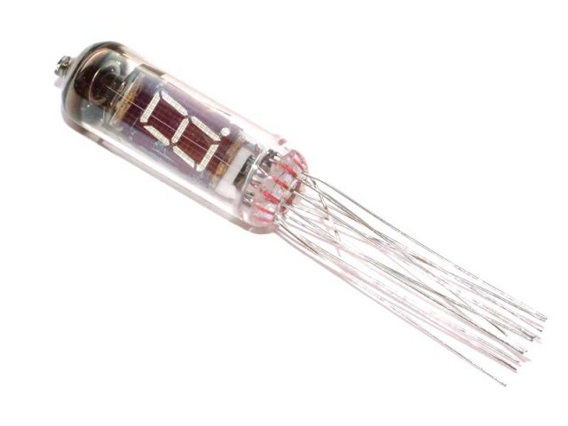
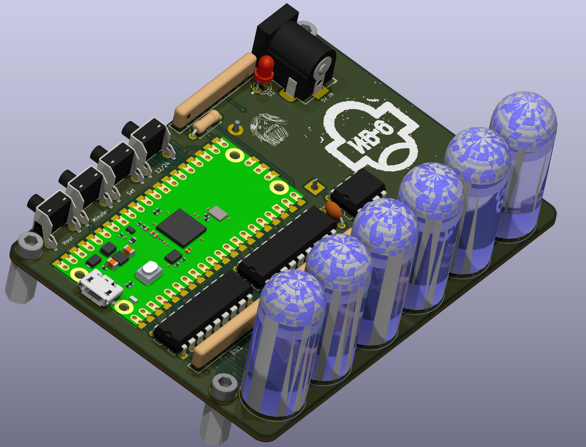

# IV6Thingie

*This does not work yet... It may never work. I'm just goofing around*

When one learns to use a particular 7 segment display, they first make a clock.

I bought a bunch of used IV-6 (ИВ-6) 7 segment display tubes on a whim and they've been sitting in a box for years.

So, I picked out 6 of the cleanest ones and will make a clock.

## Goals

I'm not trying to invent anything new here, I'm just playing with some old electronics parts.

- Use 6 of the 49 tubes I have on hand
- Use a manufactured PCB
- Use a small PCB so it's cheap
- Use available power converter modules rather than futz with that sort of thing
- Use one of these Raspberry PI Picos I have just sitting here
- Excusively use parts that are available from our good pals at AliExpress
